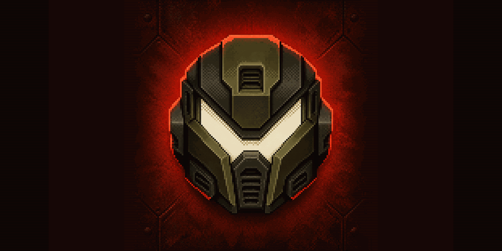

# Mood



Mood is a Kotlin Multiplatform project that turns the classic 1990s game Doom into
a playable application for multiplatform targets (Currently demonstrating Android and
Web).

The project was created for a couple of reasons:

- To explore a modern Kotlin Multiplatform project and get a handle on exactly how
much can be shared today
- As a stress test for [Chasm](https://github.com/CharlieTap/chasm) which the project
leverages to run the Doom game

Whilst I've made an effort to organise and tradcode parts of the codebase you'll
still find plenty of slop inside

## How does it work?

The original Doom game is compiled to WebAssembly. The
[WebAssembly binary](doom-runtime/src/commonMain/composeResources/files/doom/doom.wasm)
lives in `doom-runtime`, where Chasm's Gradle plugin reads it and generates type-safe
Kotlin bindings for its exported functions and memory. After code generation, those
sources can be found at
`doom-runtime/build/generated/kotlin/commonMain/com/tap/mood/doom/runtime/generated`.
On the web, the generated binding uses the browser's WebAssembly runtime; on Android,
it uses Chasm's interpreter.

[`doom-runtime`](doom-runtime/src/commonMain/kotlin/com/tap/mood/doom/runtime) contains
the shared code around that binding. It creates and drives a running
[game instance](doom-runtime/src/commonMain/kotlin/com/tap/mood/doom/runtime/instance/Instance.kt),
handles input and frames, and defines the interfaces used for audio, saved games,
logging and execution.

[`doom-ui`](doom-ui/src/commonMain/kotlin/com/tap/mood/doom/ui) contains the shared
Compose interface, including the game screen, settings and performance information.
[`game-controls`](game-controls/src/commonMain/kotlin/com/tap/mood/game/controls) contains
reusable virtual buttons and joysticks. Android enables these controls, while the web
application uses a keyboard-focused interface.

Rendering is one of the few platform-specific parts. The
[Android renderer](doom-ui/src/androidMain/kotlin/com/tap/mood/doom/ui/rendering/Surface.android.kt)
copies each frame into a `Bitmap` and draws it with `Canvas`. The
[web renderer](doom-ui/src/wasmJsMain/kotlin/com/tap/mood/doom/ui/rendering/Surface.wasmJs.kt)
writes the frame into `ImageData` and displays it on an HTML canvas. 

## How to play?

You can try the web distribution hosted on Github pages:

https://charlietap.github.io/mood/

Alternatively you can build from source

### Android

```shell
./gradlew :android:assembleDebug
adb install -r android/build/outputs/apk/debug/android-debug.apk
```

### Web

```shell
./gradlew :web:wasmJsBrowserDevelopmentRun
```

## Doom source

The Doom source used to produce the WebAssembly binary is available in [`CharlieTap/doom.wasm` at commit `ae336d991d3a297f011d99e333410108a47c6a6e`](https://github.com/CharlieTap/doom.wasm/tree/ae336d991d3a297f011d99e333410108a47c6a6e).

## License

Except for the Doom-derived WebAssembly module, Mood's source code is dual-licensed under both the MIT and Apache 2.0 licenses. You can choose which one you want to use the software under.

- For details on the MIT license, please see the [LICENSE-MIT](LICENSE-MIT) file.
- For details on the Apache 2.0 license, please see the [LICENSE-APACHE](LICENSE-APACHE) file.
